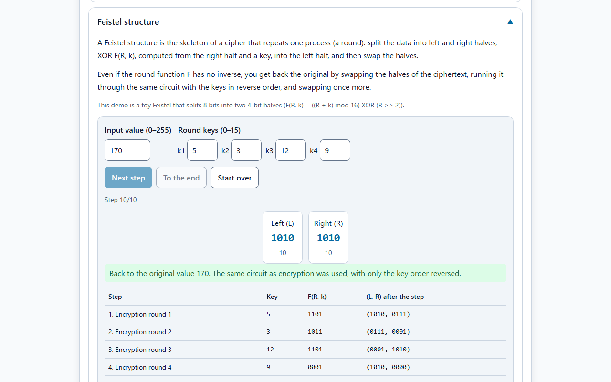
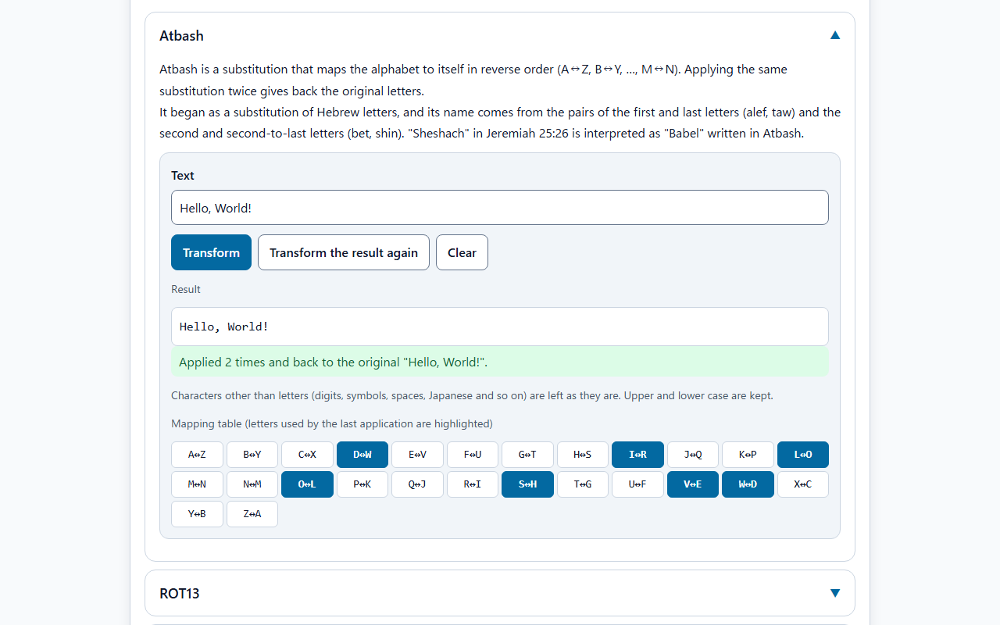
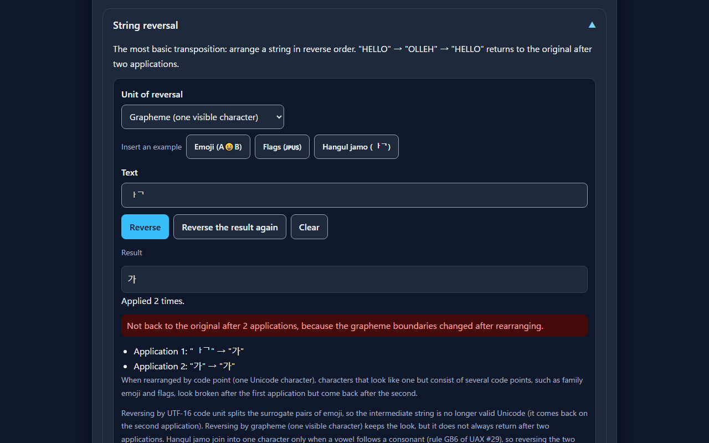
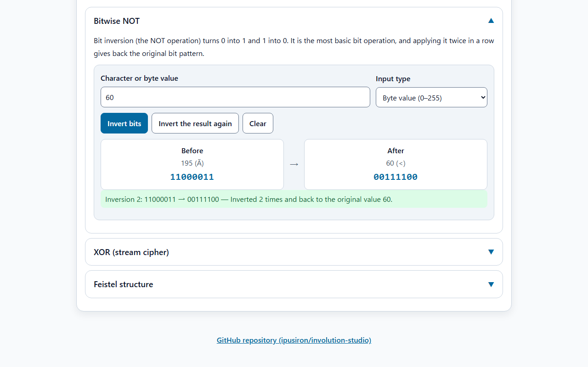

English · [日本語](README.md)

# Involution Studio - Comprehensive Involution Experience Hub


[](https://ipusiron.github.io/involution-studio/)

**Day051 - 100 Security Tools with Generative AI**

Involution Studio is a learning hub for checking involutions, transforms that return to the original when applied twice, with lightweight demos. Each demo for substitution (Atbash, ROT13, ROT47), transposition (string reversal, pair swap, matrix transposition) and bitwise operations (NOT, Feistel structure) has a button that applies the transform to the result again, so you can see it return to the original on the second application. The Feistel structure is shown one step at a time, from encryption to decryption on the same circuit with the keys in reverse order.

---

## 🌐 Demo

👉 **[https://ipusiron.github.io/involution-studio/](https://ipusiron.github.io/involution-studio/)**

You can try it directly in your browser.

---

## 📸 Screenshots

>
>
>*Feistel structure. After 4 encryption rounds, the keys went through the same circuit in reverse order and the value is back to 170*

>
>
>*Atbash. "Hello, World!" transformed twice and back to the original, with the letters used in the second application highlighted in the table*

>
>
>*String reversal (dark). A string with an emoji reversed twice by code point and back to the original*

>
>
>*Bitwise NOT. The byte value 60 inverted twice and back to 00111100*

---

## ✨ Features

### 📚 Four tabs

- Involution basics: the definition (f(f(x)) = x), mathematical examples, use in cryptography and the relation to security
- Substitution: lightweight demos of Atbash, ROT13 and ROT47. For Atbash, a table of the 26 pairs highlights the letters used last
- Transposition: lightweight demos of string reversal, pair swap and transposing a 3×3 matrix
- Bitwise: 8-bit NOT and a toy Feistel structure (8 bits split into two 4-bit halves)

### 🔁 Check that the second application gives back the original

- Each demo has "Transform" and "Transform the result again". When the second result matches the first input, the page says so
- String reversal lists which string became which in each application
- Matrix transposition compares the current matrix with the original and shows "Original matrix" or "Transposed matrix"
- Bitwise NOT accepts a character (U+0000–U+00FF) or a byte value from 0 to 255 and shows it in binary

### 🧩 Step-by-step Feistel structure

- From an input value (0–255) and four round keys (0–15), it goes through 10 steps one at a time: 4 encryption rounds → swap the halves → 4 rounds on the same circuit with the keys in reverse order → swap
- For each step, it lists the key, F(R, k) and (L, R) after the step
- You can also apply one round without the swap, (L, R) → (L ⊕ F(R, k), R), twice and see it return to the original

### 🌐 Interface

- Switch between Japanese and English (decided by ?lang=ja or ?lang=en, then the saved choice, then the browser language)
- Switch between light and dark (follows the OS setting at first)
- No horizontal overflow even on a 320px-wide smartphone. Input fields use 16px text, and buttons are at least 44px tall

---

## 📖 Usage

1. Choose a topic with the tabs (basics, substitution, transposition, bitwise)
2. Press a heading to open the item you want (any number can be open at once)
3. Enter a string in a lightweight demo and press "Transform"
4. Press "Transform the result again" and check that the second application gives back the original input
5. In the Feistel structure, "Next step" goes one step at a time and "To the end" goes all the way. Changing the input value or a key starts over
6. For long texts or files, move to the dedicated tools from the link in each item

---

## 🔗 Relation to the dedicated tools

Check the property with the lightweight demos here, and work in earnest with the dedicated tools.

| Topic | Lightweight demo in this tool | Dedicated tool |
|---|---|---|
| Substitution | ROT13 and its second application | [ROT13 Encoder](https://ipusiron.github.io/rot13-encoder/) |
| Substitution | ROT47 and its second application | [QuickROT47](https://ipusiron.github.io/quick-rot47/) |
| Transposition | Transposing a 3×3 matrix | [Columnar CipherLab](https://ipusiron.github.io/columnar-cipherlab/) |

---

## 🔬 Technical notes

### What is an involution?

An involution is a transform that returns to the original when applied twice, written f(f(x)) = x in mathematics. It is a function that is its own inverse. Typical examples are matrix transposition ((Aᵀ)ᵀ = A), sign negation (−(−x) = x) and the reciprocal (1/(1/x) = x, x ≠ 0).

In cryptography, an involutory transform makes encryption and decryption the same procedure. Atbash, ROT13 and ROT47 are all involutions.

| Transform | Example (first application) | Second application |
|---|---|---|
| Atbash | HELLO → SVOOL | SVOOL → HELLO |
| ROT13 | Hello, World! → Uryyb, Jbeyq! | Uryyb, Jbeyq! → Hello, World! |
| ROT47 | Hello World! → w6==@ (@C=5P | w6==@ (@C=5P → Hello World! |
| String reversal | HELLO → OLLEH | OLLEH → HELLO |
| Pair swap | ABCD → BADC | BADC → ABCD |
| Bitwise NOT | 65 (01000001) → 190 (10111110) | 190 → 65 |

### Origin of Atbash

Atbash is a substitution that maps the alphabet to itself in reverse order. It began as a substitution of Hebrew letters, and its name comes from the pairs of the first and last letters (alef, taw) and the second and second-to-last letters (bet, shin). "Sheshach" in Jeremiah 25:26 is interpreted as "Babel" written in Atbash.

### What counts as one character when reversing

String reversal and pair swap rearrange by Unicode code point. Rearranging by UTF-16 code unit would split the surrogate pairs of emoji, so the intermediate string would no longer be valid Unicode (it would still come back on the second application). Characters that look like one but consist of several code points, such as family emoji and flags, look broken after the first application but come back after the second.

### Pair swap and the perfect shuffle

Pair swap, which swaps each pair of adjacent characters, is an involution. A perfect shuffle of playing cards (split the deck in half and interleave the cards one by one) is a different operation and does not return after two shuffles. With 52 cards, the original order comes back after 8 out-shuffles, where the top card stays on top, or 52 in-shuffles, where it goes second (Diaconis, Graham and Kantor, 1983).

### Feistel structure

A Feistel structure is the skeleton of a cipher that repeats one process (a round): split the data into left and right halves, XOR F(R, k), computed from the right half and a key, into the left half, and then swap the halves. Even if the round function F has no inverse, you get back the original by swapping the halves of the ciphertext, running it through the same circuit with the keys in reverse order, and swapping once more. DES decrypts with the same algorithm as encryption and uses the 16 keys in reverse order, from K16 to K1 (FIPS 46-3).

The Feistel in this tool is a toy that splits 8 bits into two 4-bit halves, with F(R, k) = ((R + k) mod 16) XOR (R >> 2). With the input value 170 (10101010) and the keys 5, 3, 12 and 9, the steps are as follows.

| Step | Key | F(R, k) | (L, R) after the step |
|---|---|---|---|
| 1. Encryption round 1 | 5 | 1101 | (1010, 0111) |
| 2. Encryption round 2 | 3 | 1011 | (0111, 0001) |
| 3. Encryption round 3 | 12 | 1101 | (0001, 1010) |
| 4. Encryption round 4 | 9 | 0001 | (1010, 0000) |
| 5. Swap halves | — | — | (0000, 1010) |
| 6. Decryption round 1 | 9 | 0001 | (1010, 0001) |
| 7. Decryption round 2 | 12 | 1101 | (0001, 0111) |
| 8. Decryption round 3 | 3 | 1011 | (0111, 1010) |
| 9. Decryption round 4 | 5 | 1101 | (1010, 1010) |
| 10. Swap halves | — | — | (1010, 1010) |

- The ciphertext is (1010, 0000) = 160 after step 4, and step 10 gives back the original 170
- F(R, k) in each decryption round equals the value of the encryption rounds traced backwards
- One round without the swap, (L, R) → (L ⊕ F(R, k), R), is an involution by itself, because XORing the same F(R, k) again cancels it out
- Running 4 rounds with the same key does not necessarily return to the original value. With the F of this tool, only 50 of the 4096 combinations of input and key do

### Involutions and security

Atbash, ROT13 and ROT47 have no key. Anyone who knows the method can undo them with the same operation, so they make text unreadable at a glance (obfuscation) rather than keep secrets. Being an involution is not a weakness in itself, and Feistel ciphers such as DES also encrypt and decrypt on the same circuit. What keeps such ciphers secure is the key.

### References

- NIST, "FIPS PUB 46-3: Data Encryption Standard (DES)", 1999 — [csrc.nist.gov](https://csrc.nist.gov/files/pubs/fips/46-3/final/docs/fips46-3.pdf)
- P. Diaconis, R. L. Graham, W. M. Kantor, "The Mathematics of Perfect Shuffles", Advances in Applied Mathematics 4, 175–196, 1983 — [doi.org](https://doi.org/10.1016/0196-8858(83)90009-X)
- Faculty of Theology and Religion, University of Oxford, "Crack the Code! Learn about the atbash cipher and how to crack it!" — [theology.web.ox.ac.uk](https://theology.web.ox.ac.uk/node/330161)
- The Jewish Chronicle, "Atbash" — [thejc.com](https://www.thejc.com/judaism/jewish-words/atbash-a9riafa5)

---

## 🎯 Use cases

- Math classes and self-study: check function composition, inverse functions and the identity map by hand with strings and matrices. The phrase "its own inverse" connects with a screen that returns to the original on the second application
- Computing and programming classes: show with emoji reversal that "one character" differs between code points and what you see
- Introduction to cryptography: follow, from Atbash and ROT13 to the Feistel structure, how encryption and decryption become the same procedure
- Learning modern cryptography: trace with an 8-bit step table why Feistel ciphers such as DES decrypt on the same circuit just by reversing the order of the keys. The Feistel in this tool is a toy for learning and has no strength as a cipher
- Software test design: explain the idea of a round-trip test, which checks that encoding and then decoding gives back the original, with the act of applying a transform twice
- CTF and puzzle preparation: undo short strings written in Atbash, ROT13 or ROT47 with the same operation. These transforms have no key, so do not use them to keep secrets
- Making puzzle events and escape games: research gimmicks where doing the same operation once more reveals the answer
- History and religious history classes: introduce Atbash, which comes from a substitution of Hebrew letters, and the "Sheshach" example in Jeremiah
- Card tricks and magic: talk about the difference between pair swap, which returns after two applications, and the perfect shuffle (out-shuffle), which takes 8 shuffles with 52 cards
- Electronics and logic circuits: check with 8-bit binary that passing through NOT twice gives back the original bits
- Explaining text masking: explain that ROT13 only hides spoilers and that anyone who knows the method can read it
- Combining with other tools: after checking the property here, handle long texts with ROT13 Encoder, QuickROT47 or Columnar CipherLab

This tool is for learning. Please do not misuse it.

---

## 🔒 Security and privacy

- Strings you enter are processed only in your browser and are not sent anywhere
- The Content Security Policy (meta) limits scripts and styles to files from the same origin and allows no inline scripts or styles. It also allows no external connections
- Text on the page is shown only through `textContent` (never interpreted as HTML)
- The browser stores only the language and theme choices. The page works even where storage is unavailable
- External links have `rel="noopener noreferrer"` and send no referrer

---

## ⚠️ Notes and limitations

- The Feistel demo is an 8-bit, 4-round toy for learning. It does not reproduce the initial permutation, expansion permutation, S-boxes, 16 rounds and so on of DES
- Atbash, ROT13 and ROT47 are transforms without a key and are not ciphers that keep secrets
- String reversal and pair swap work by code point. Emoji made of several code points look broken after the first application
- Bitwise NOT handles only 8 bits. Characters are limited to one character from U+0000 to U+00FF
- Input fields accept up to 200 characters

---

## 🧪 Tests

```bash
npm test
```

- Runs on the standard Node.js 22+ test runner (`node:test`) with no dependencies. GitHub Actions runs it on every push and pull request
- Core: Atbash, ROT13, ROT47, string reversal and pair swap return to the original after two applications (ASCII, Japanese, emoji, combining characters), NOT for all 256 values, transposition, input parsing, every Feistel step (256 values × 46 key sets) and the half round for all 4096 combinations
- index.html CSP, ARIA (tabs and accordions), labels and agreement with the dictionary, the Japanese and English dictionaries, language selection, color contrast (text 4.5:1 and borders 3:1 or more, in light and dark), and line length
- The tables and numbers in both READMEs (the transform examples, the Feistel step table, 50 of 4096, the number of perfect shuffles), the directory tree and the images are also checked against the implementation

---

## 📁 Directory structure

```
involution-studio/
├── .github/                           # GitHub settings
│   └── workflows/                     # GitHub Actions workflows
│       └── test.yml                   # Runs npm test on push and pull request
├── assets/                            # README images
│   ├── en/                            # Images for the English README
│   │   ├── screenshot.png             # Step-by-step Feistel structure
│   │   ├── screenshot2.png            # Atbash
│   │   ├── screenshot3.png            # String reversal (dark)
│   │   └── screenshot4.png            # Bitwise NOT
│   ├── screenshot.png                 # Screenshot for the Japanese README (Feistel)
│   ├── screenshot2.png                # Screenshot for the Japanese README (Atbash)
│   ├── screenshot3.png                # Screenshot for the Japanese README (string reversal, dark)
│   └── screenshot4.png                # Screenshot for the Japanese README (bitwise NOT)
├── js/                                # Scripts
│   ├── i18n.js                        # Language selection and replacing the text in HTML
│   ├── involution-core.js             # Core (transforms, input parsing, Feistel steps)
│   ├── messages.js                    # Text on the page (Japanese and English)
│   ├── theme-init.js                  # Applies the saved theme before drawing
│   └── theme.js                       # Light and dark switching
├── test/                              # Automated tests (node:test)
│   ├── contrast.test.js               # Color contrast and control sizes
│   ├── core.test.js                   # Core (round trips, known answers, Feistel)
│   ├── explore.test.js                # Core (order, checker, Enigma, reversal units, XOR)
│   ├── format.test.js                 # Line length and line endings
│   ├── html.test.js                   # CSP, ARIA, labels and agreement with the dictionary
│   ├── i18n.test.js                   # Language selection
│   ├── load.js                        # Loads the page scripts into the tests
│   ├── messages.test.js               # Japanese and English dictionaries
│   └── readme.test.js                 # README tables, numbers, structure and images
├── .gitignore                         # Files excluded from Git
├── .nojekyll                          # Disables Jekyll on GitHub Pages
├── CLAUDE.md                          # Project notes for AI-assisted development
├── LICENSE                            # MIT License
├── README.en.md                       # This document
├── README.md                          # Japanese README
├── index.html                         # The page
├── package.json                       # npm test settings (no dependencies)
├── script.js                          # Page logic (DOM)
└── styles.css                         # Styles (light and dark)
```

---

## 💻 Requirements

- Checked on Chromium, Microsoft Edge and Firefox
- No server is needed. Opening index.html directly in a browser also works

---

## 📄 License

- See the `LICENSE` file for the source code license.

---

## 🛠️ About this tool

This tool was developed as part of the "100 Security Tools with Generative AI" project.
The project builds and publishes a variety of security-related tools over 100 days with the help of AI.

For details about the project and other tools, see the page below.

🔗 [https://akademeia.info/?page_id=42163](https://akademeia.info/?page_id=42163)
