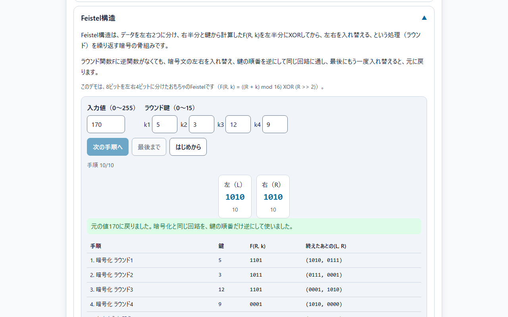
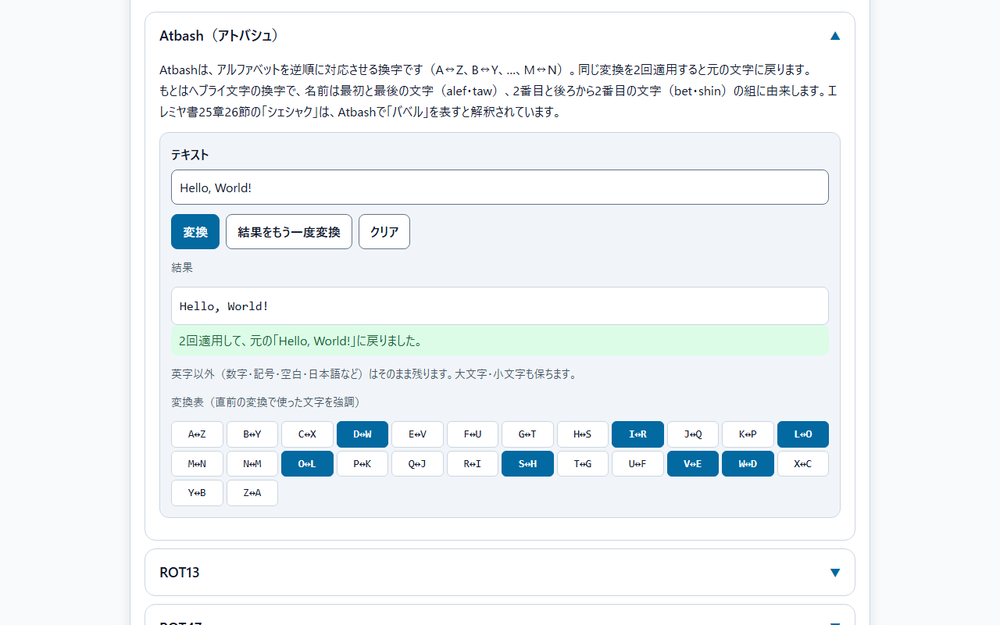
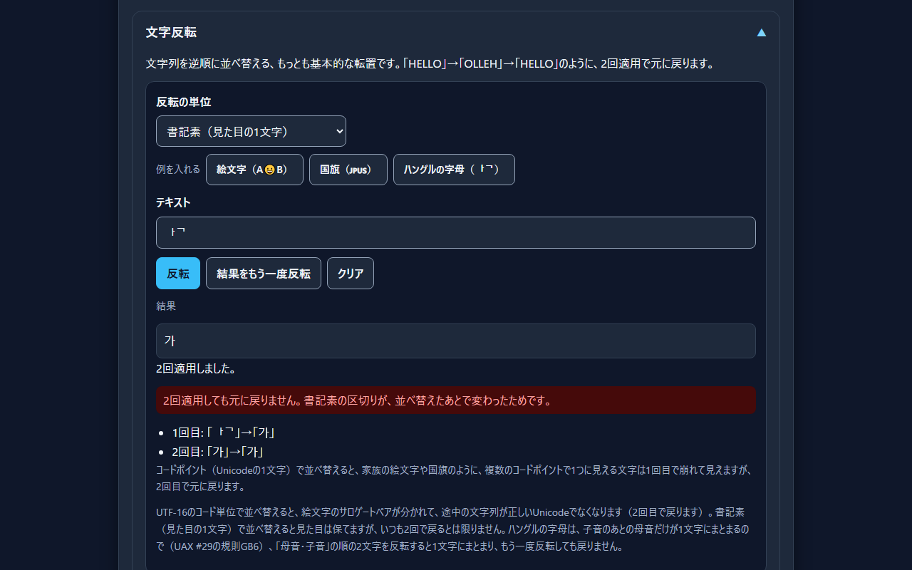
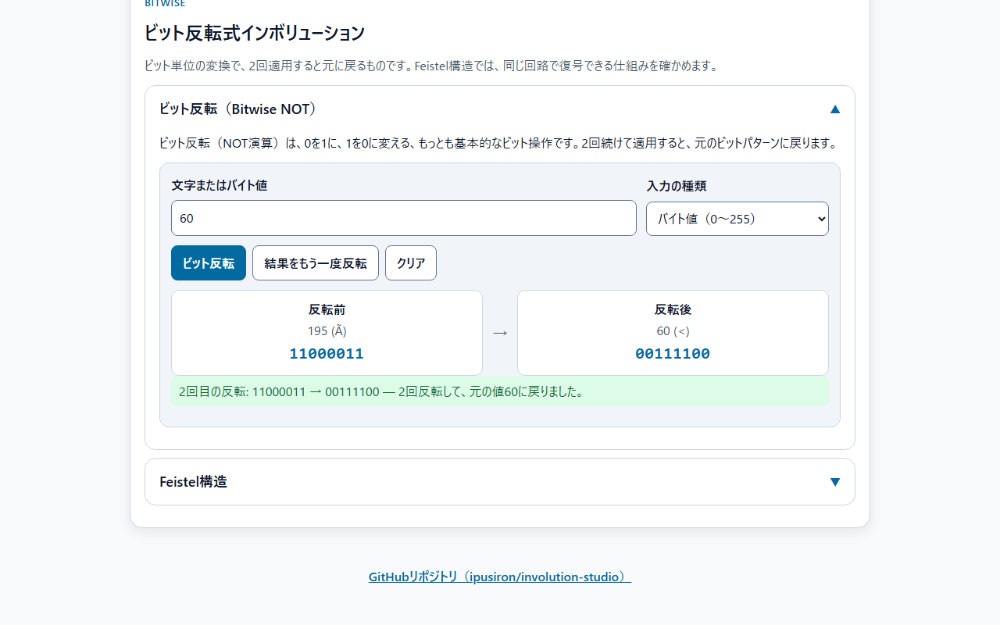

<!--
---
id: day051
slug: involution-studio

title: "Involution Studio"

subtitle_ja: "インボリューション総合体験ハブツール"
subtitle_en: "Comprehensive Involution Experience Hub"

description_ja: "「2回適用すると元に戻る」インボリューションを、換字式・転置式・ビット反転式の軽量デモとFeistel構造の手順表示で体験し、専用ツールへ案内する学習ハブ"
description_en: "A learning hub for involutions (f(f(x)) = x) with lightweight demos of substitution, transposition and bitwise operations, a step-by-step Feistel structure, and links to dedicated tools"

category_ja:
  - 古典暗号
  - 現代暗号
category_en:
  - Classical Cryptography
  - Modern Cryptography

difficulty: 2

tags:
  - involution
  - cryptography
  - education
  - visualization
  - atbash
  - rot13
  - rot47
  - feistel

repo_url: "https://github.com/ipusiron/involution-studio"
demo_url: "https://ipusiron.github.io/involution-studio/"

hub: true
---
-->

[English](README.en.md) · 日本語

# Involution Studio - インボリューション総合体験ハブツール


[](https://ipusiron.github.io/involution-studio/)

**Day051 - 生成AIで作るセキュリティツール100**

Involution Studioは、「2回適用すると元に戻る」変換であるインボリューション（involution）を、軽量デモで確かめる学習ハブです。換字式（Atbash・ROT13・ROT47）、転置式（文字反転・ペア交換・行列の転置）、ビット反転式（NOT・Feistel構造）の各デモに「結果をもう一度」のボタンがあり、2回目で元に戻る様子をその場で確かめられます。Feistel構造は、暗号化から、鍵の順番を逆にして同じ回路で復号するまでを1手順ずつ表示します。

---

## 🌐 デモページ

👉 **[https://ipusiron.github.io/involution-studio/](https://ipusiron.github.io/involution-studio/)**

ブラウザーで直接お試しいただけます。

---

## 📸 スクリーンショット

>
>
>*Feistel構造。暗号化の4ラウンドのあと、同じ回路に鍵を逆順で通して元の値170に戻ったところ*

>
>
>*Atbash。「Hello, World!」を2回変換して元に戻り、2回目に使った文字を変換表で強調したところ*

>
>
>*文字反転（ダーク）。絵文字を含む文字列をコードポイント単位で2回反転して元に戻ったところ*

>
>
>*ビット反転。バイト値60を2回反転して、00111100に戻ったところ*

---

## ✨ 機能

### 📚 4つのタブ

- インボリューション基礎: 定義（f(f(x)) = x）、数学的な例、暗号での使われ方、安全性との関係
- 換字式: Atbash・ROT13・ROT47の軽量デモ。Atbashは26組の変換表で、直前に使った文字を強調する
- 転置式: 文字反転・ペア交換・3×3行列の転置の軽量デモ
- ビット反転式: 8ビットのNOTと、おもちゃのFeistel構造（8ビットを左右4ビットに分ける）

### 🔁 2回目で元に戻ることを確かめる

- 各デモに「変換」と「結果をもう一度変換」がある。2回目の結果が最初の入力と一致すると、そのことを表示する
- 文字反転は、何回目にどの文字列からどの文字列になったかを並べる
- 行列の転置は、いまの行列と元の行列を比べて「元の行列」「転置した行列」を表示する
- ビット反転は、文字（U+0000〜U+00FF）か0〜255のバイト値を受け付け、2進数で並べる

### 🧩 Feistel構造の手順表示

- 入力値（0〜255）と4つのラウンド鍵（0〜15）から、暗号化4ラウンド → 左右の入れ替え → 鍵を逆順にして同じ回路で4ラウンド → 入れ替え、の10手順を1つずつ進める
- 各手順の鍵・F(R, k)・終えたあとの(L, R)を表にする
- 入れ替えを除いた1ラウンド(L, R) → (L ⊕ F(R, k), R)を2回適用して、元に戻ることも確かめられる

### 🌐 画面

- 日本語と英語を切り替えられる（?lang=ja・?lang=en、保存した選択、ブラウザーの言語の順に決まる）
- ライトとダークを切り替えられる（初めはOSの設定に従う）
- 幅320pxのスマートフォンでも横にはみ出さない。入力欄は16px、ボタンは高さ44px以上

---

## 📖 使い方

1. タブで分野（基礎・換字式・転置式・ビット反転式）を選ぶ
2. 見出しを押して、知りたい項目を開く（いくつでも同時に開ける）
3. 軽量デモに文字列を入れて「変換」を押す
4. 「結果をもう一度変換」を押し、2回目で元の入力に戻ることを確かめる
5. Feistel構造では「次の手順へ」で1手順ずつ、「最後まで」で一度に進める。入力値や鍵を変えると、はじめからやり直す
6. 長い文やファイルを扱うときは、各項目のリンクから専用ツールへ移る

---

## 🔗 連携ツールとの関係

軽量デモで性質を確かめ、専用ツールで本格的に扱う、という使い分けです。

| 分野 | このツールでの軽量デモ | 専用ツール |
|---|---|---|
| 換字式 | ROT13の変換と2回目の確認 | [ROT13 Encoder](https://ipusiron.github.io/rot13-encoder/) |
| 換字式 | ROT47の変換と2回目の確認 | [QuickROT47](https://ipusiron.github.io/quick-rot47/) |
| 転置式 | 3×3行列の転置 | [Columnar CipherLab](https://ipusiron.github.io/columnar-cipherlab/) |

---

## 🔬 技術的な説明

### インボリューションとは

インボリューションは、同じ変換を2回適用すると元に戻る変換で、数学ではf(f(x)) = xと書きます。自分自身が逆関数になっている関数です。行列の転置（(Aᵀ)ᵀ = A）、符号の反転（−(−x) = x）、逆数（1/(1/x) = x、x ≠ 0）が典型例です。

暗号では、インボリューションの変換を使うと、暗号化と復号が同じ手順になります。Atbash・ROT13・ROT47はどれもインボリューションです。

| 変換 | 例（1回目） | 2回目 |
|---|---|---|
| Atbash | HELLO → SVOOL | SVOOL → HELLO |
| ROT13 | Hello, World! → Uryyb, Jbeyq! | Uryyb, Jbeyq! → Hello, World! |
| ROT47 | Hello World! → w6==@ (@C=5P | w6==@ (@C=5P → Hello World! |
| 文字反転 | HELLO → OLLEH | OLLEH → HELLO |
| ペア交換 | ABCD → BADC | BADC → ABCD |
| ビット反転 | 65（01000001） → 190（10111110） | 190 → 65 |

### Atbashの由来

Atbashは、アルファベットを逆順に対応させる換字です。もとはヘブライ文字の換字で、名前は最初と最後の文字（alef・taw）、2番目と後ろから2番目の文字（bet・shin）の組に由来します。エレミヤ書25章26節の「シェシャク」は、Atbashで「バベル」を表すと解釈されています。

### 何を1文字として反転するか

文字反転とペア交換は、Unicodeのコードポイント単位で並べ替えます。UTF-16のコード単位で並べ替えると、絵文字のサロゲートペアが分かれて、途中の文字列が正しいUnicodeでなくなるためです（2回目で元には戻ります）。家族の絵文字や国旗のように、複数のコードポイントで1つに見える文字は、1回目で崩れて見えますが、2回目で元に戻ります。

### ペア交換とパーフェクトシャッフル

隣り合う2文字ずつを入れ替えるペア交換はインボリューションです。トランプのパーフェクトシャッフル（山を半分に分け、1枚ずつ交互に重ねる）は別の操作で、2回では元に戻りません。52枚では、いちばん上の札が上に残るアウトシャッフルなら8回、2枚目に入るインシャッフルなら52回で元の順に戻ります（Diaconis・Graham・Kantor, 1983）。

### Feistel構造

Feistel構造は、データを左右2つに分け、右半分と鍵から計算したF(R, k)を左半分にXORしてから左右を入れ替える、という処理（ラウンド）を繰り返す暗号の骨組みです。ラウンド関数Fに逆関数がなくても、暗号文の左右を入れ替え、鍵の順番を逆にして同じ回路に通し、最後にもう一度入れ替えると元に戻ります。DESは、復号に暗号化と同じアルゴリズムを使い、16個の鍵をK16からK1の逆順で使います（FIPS 46-3）。

本ツールのFeistelは、8ビットを左右4ビットに分けたおもちゃで、F(R, k) = ((R + k) mod 16) XOR (R >> 2)です。入力値170（10101010）、鍵5・3・12・9のときの手順は次のとおりです。

| 手順 | 鍵 | F(R, k) | 終えたあとの(L, R) |
|---|---|---|---|
| 1. 暗号化 ラウンド1 | 5 | 1101 | (1010, 0111) |
| 2. 暗号化 ラウンド2 | 3 | 1011 | (0111, 0001) |
| 3. 暗号化 ラウンド3 | 12 | 1101 | (0001, 1010) |
| 4. 暗号化 ラウンド4 | 9 | 0001 | (1010, 0000) |
| 5. 左右を入れ替え | — | — | (0000, 1010) |
| 6. 復号 ラウンド1 | 9 | 0001 | (1010, 0001) |
| 7. 復号 ラウンド2 | 12 | 1101 | (0001, 0111) |
| 8. 復号 ラウンド3 | 3 | 1011 | (0111, 1010) |
| 9. 復号 ラウンド4 | 5 | 1101 | (1010, 1010) |
| 10. 左右を入れ替え | — | — | (1010, 1010) |

- 暗号文は手順4のあとの(1010, 0000)＝160で、手順10で元の170に戻る
- 復号の各ラウンドのF(R, k)は、暗号化のラウンドを逆からたどった値と同じになる
- 入れ替えを除いた1ラウンド(L, R) → (L ⊕ F(R, k), R)は、それ自体がインボリューションである。同じF(R, k)をもう一度XORすると打ち消し合うため
- 同じ鍵のまま4ラウンド続けても、元の値に戻るとは限らない。本ツールのFでは、入力と鍵の4096通りのうち戻るのは50通りだけである

### インボリューションと安全性

Atbash・ROT13・ROT47には鍵がありません。方式を知っていれば誰でも同じ操作で元に戻せるので、秘密を守る暗号ではなく、ひと目で読めなくする（難読化）ための変換です。インボリューションであること自体は弱点ではなく、DESのようなFeistel構造の暗号も、同じ回路で暗号化と復号を行います。そうした暗号の安全性を支えているのは鍵です。

### 参考文献

- NIST, "FIPS PUB 46-3: Data Encryption Standard (DES)", 1999 — [csrc.nist.gov](https://csrc.nist.gov/files/pubs/fips/46-3/final/docs/fips46-3.pdf)
- P. Diaconis, R. L. Graham, W. M. Kantor, "The Mathematics of Perfect Shuffles", Advances in Applied Mathematics 4, 175–196, 1983 — [doi.org](https://doi.org/10.1016/0196-8858(83)90009-X)
- Faculty of Theology and Religion, University of Oxford, "Crack the Code! Learn about the atbash cipher and how to crack it!" — [theology.web.ox.ac.uk](https://theology.web.ox.ac.uk/node/330161)
- The Jewish Chronicle, "Atbash" — [thejc.com](https://www.thejc.com/judaism/jewish-words/atbash-a9riafa5)

---

## 🎯 ユースケース

- 数学の授業・自習: 関数の合成・逆関数・恒等写像を、文字列や行列に手を動かして確かめる。「自分自身が逆関数」という言い方が、2回目で元に戻る画面と結びつく
- 情報・プログラミングの授業: Unicodeの「1文字」がコードポイントと見た目で違うことを、絵文字の文字反転で示す
- 暗号の入門: 暗号化と復号が同じ手順になる仕組みを、Atbash・ROT13からFeistel構造まで順にたどる
- 現代暗号の学習: DESなどのFeistel構造が、鍵の順番を逆にするだけで同じ回路で復号できる理由を、8ビットの手順表で追う。本ツールのFeistelは学習用のおもちゃで、暗号としての強さはない
- ソフトウェアのテスト設計: エンコードとデコードを往復させて元に戻るかを確かめる「往復テスト」の考え方を、変換を2回かける操作で説明する
- CTF・謎解きの準備: Atbash・ROT13・ROT47で書かれた短い文字列を、同じ操作で元に戻す。鍵のない変換なので、秘密を守る用途には使わない
- 謎解きイベント・脱出ゲームの制作: 「同じ操作をもう一度すると答えが出る」仕掛けの考証に使う
- 歴史・宗教史の授業: ヘブライ文字の換字に由来するAtbashと、エレミヤ書の「シェシャク」の例を紹介する
- トランプ・手品の話題: 2回で戻るペア交換と、52枚で8回かかるパーフェクトシャッフル（アウトシャッフル）の違いを話す
- 電子工作・論理回路の学習: NOTを2回通すと元のビットに戻ることを、8ビットの2進数で確かめる
- 文章の目隠しの説明: ROT13がネタバレを伏せる程度の目隠しであり、方式を知る人には読まれることを説明する
- ほかのツールとの組み合わせ: ここで性質を確かめたあと、ROT13 Encoder・QuickROT47・Columnar CipherLabで長い文を扱う

本ツールは学習用です。悪用はおやめください。

---

## 🔒 セキュリティとプライバシー

- 入力した文字列はブラウザーの中だけで処理し、外部へ送信しません
- Content Security Policy（meta）で、スクリプト・スタイルを同じ場所のファイルだけに限り、インラインのスクリプト・スタイルを許していません。外部への通信も許していません
- 画面の文字列は`textContent`でだけ表示します（HTMLとして解釈しません）
- ブラウザーに保存するのは、言語とテーマの選択だけです。保存できない環境でも動きます
- 外部リンクには`rel="noopener noreferrer"`を付け、リファラーを送りません

---

## ⚠️ 注意と限界

- Feistel構造のデモは、8ビット・4ラウンドの学習用のおもちゃです。DESの初期転置・拡大転置・Sボックス・16ラウンドなどは再現していません
- Atbash・ROT13・ROT47は鍵のない変換で、秘密を守る暗号ではありません
- 文字反転とペア交換はコードポイント単位です。複数のコードポイントでできた絵文字は、1回目で崩れて見えます
- ビット反転は8ビットだけを扱います。文字はU+0000〜U+00FFの1文字に限ります
- 入力欄は200文字までです

---

## 🧪 テスト

```bash
npm test
```

- Node.js 22以上の標準のテストランナー（`node:test`）で動き、依存パッケージはありません。GitHub Actionsで、pushとpull requestのたびに自動で実行します
- 計算部: Atbash・ROT13・ROT47・文字反転・ペア交換が2回で元に戻ること（ASCII・日本語・絵文字・結合文字）、256通りのNOT、転置、入力の読み取り、Feistelの全手順（256通り×46組の鍵）、半ラウンドの4096通り
- index.htmlのCSP・ARIA（タブ・アコーディオン）・ラベル・辞書との一致、日英の辞書、言語の選択、配色のコントラスト（文字4.5:1・枠3:1以上、ライト・ダークとも）、行の長さ
- READMEの表と数値（変換の例・Feistelの手順表・4096通り中50通り・パーフェクトシャッフルの回数）、ディレクトリー構造、画像（日英）も、実装と突き合わせて検証します

---

## 📁 ディレクトリー構造

```
involution-studio/
├── .github/                           # GitHub の設定
│   └── workflows/                     # GitHub Actions のワークフロー
│       └── test.yml                   # push・pull request で npm test を実行
├── assets/                            # README の画像
│   ├── en/                            # 英語版 README の画像
│   │   ├── screenshot.png             # Feistel構造の手順表示
│   │   ├── screenshot2.png            # Atbash
│   │   ├── screenshot3.png            # 文字反転（ダーク）
│   │   └── screenshot4.png            # ビット反転
│   ├── screenshot.png                 # Feistel構造の手順表示
│   ├── screenshot2.png                # Atbash
│   ├── screenshot3.png                # 文字反転（ダーク）
│   └── screenshot4.png                # ビット反転
├── js/                                # スクリプト
│   ├── i18n.js                        # 言語の選択と、HTML の文言の差し替え
│   ├── involution-core.js             # 計算部（各変換・入力の読み取り・Feistel の手順）
│   ├── messages.js                    # 画面の文言（日本語・英語）
│   ├── theme-init.js                  # 描画の前に保存したテーマを当てる
│   └── theme.js                       # ライト・ダークの切り替え
├── test/                              # 自動テスト（node:test）
│   ├── contrast.test.js               # 配色のコントラスト、操作要素の大きさ
│   ├── core.test.js                   # 計算部（往復・既知解答・Feistel）
│   ├── format.test.js                 # 行の長さ、改行コード
│   ├── html.test.js                   # CSP、ARIA、ラベル、辞書との一致
│   ├── i18n.test.js                   # 言語の選択
│   ├── load.js                        # 画面のスクリプトをテストに読み込む
│   ├── messages.test.js               # 日英の辞書
│   └── readme.test.js                 # README の表・数値・構成・画像
├── .gitignore                         # Git の管理から外すファイル
├── .nojekyll                          # GitHub Pages で Jekyll を使わない
├── CLAUDE.md                          # AI 開発用のプロジェクト説明
├── LICENSE                            # MIT ライセンス
├── README.en.md                       # 英語版 README
├── README.md                          # 本ドキュメント
├── index.html                         # 画面
├── package.json                       # npm test の設定（依存なし）
├── script.js                          # 画面の処理（DOM）
└── styles.css                         # スタイル（ライト・ダーク）
```

---

## 💻 動作環境

- Chromium・Microsoft Edge・Firefoxで動作を確認しています
- サーバーは不要です。index.htmlをブラウザーで直接開いても動きます

---

## 📄 ライセンス

- ソースコードのライセンスは`LICENSE`ファイルを参照してください。

---

## 🛠️ このツールについて

本ツールは、「生成AIで作るセキュリティツール100」プロジェクトの一環として開発されました。
このプロジェクトでは、AIの支援を活用しながら、セキュリティに関連するさまざまなツールを100日間にわたり制作・公開していく取り組みを行っています。

プロジェクトの詳細や他のツールについては、以下のページをご覧ください。

🔗 [https://akademeia.info/?page_id=42163](https://akademeia.info/?page_id=42163)
