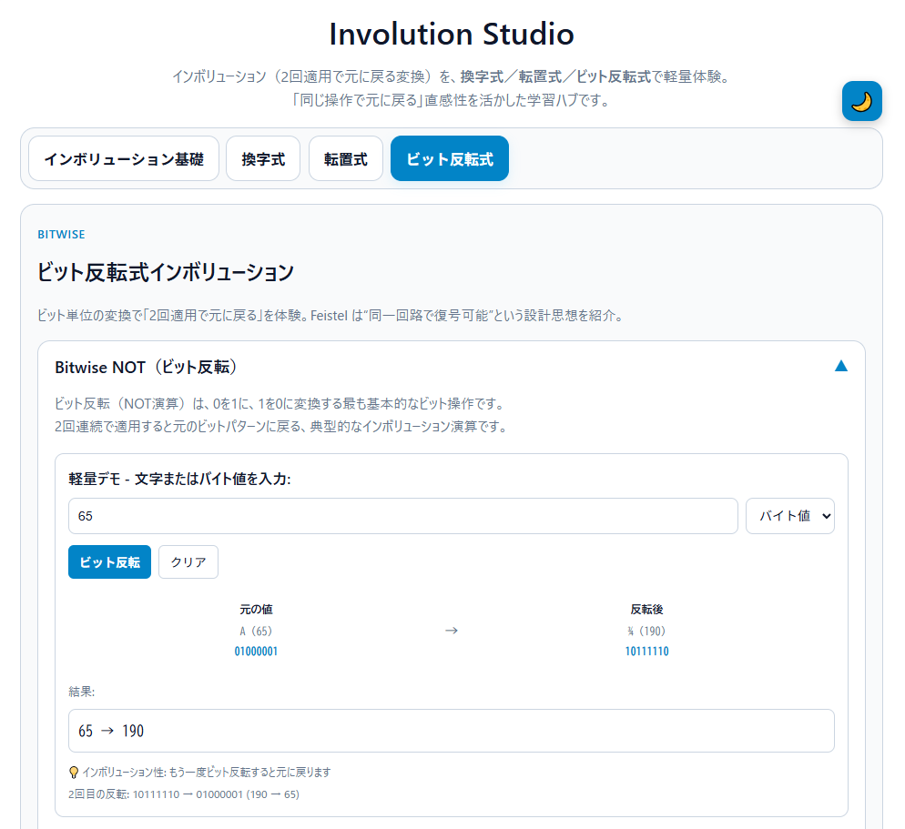

<!--
---
title: Involution Studio
category: classical-cryptography
difficulty: 1
description: Lightweight hub to explore "apply twice to get back" transforms with visual mini-demos and links to dedicated tools.
tags: [involution, cryptography, education, visualization]
demo: https://ipusiron.github.io/involution-studio/
---
-->

# Involution Studio - インボリューション総合体験ハブツール


[](https://ipusiron.github.io/involution-studio/)

「2回適用で元に戻る」という処理である、インボリューション（"involution"）を「軽量デモ＋ビジュアル重視」で直感理解し、個別ツールに誘導するハブツールです。

## 🌐 デモページ

👉 **[https://ipusiron.github.io/involution-studio/](https://ipusiron.github.io/involution-studio/)**

ブラウザーで直接お試しいただけます。

---

## 📸 スクリーンショット

>   
>
> *ダミー*

## Tabs
- 換字式インボリューション（Atbash / ROT13 / ROT47）
- 転置式インボリューション（文字反転 / ペア交換 / 行列転置）
- ビット反転式インボリューション（Bitwise NOT / Feistel可視化の導入）

## Links to dedicated tools
- ROT13: （リンク予定）
- ROT47: （リンク予定）
- 他：順次追加

## Notes
- 本リポジトリはハブ用途。重い実装は各専用ツールへリンクします。
- 数学・暗号・AI/セキュリティ観点の短い解説をタブごとに配置予定。

---

## 📁 ディレクトリー構成

```
```

---

## 📄 ライセンス

MIT License - 詳細は [LICENSE](LICENSE) をご覧ください。

---

## 🛠 このツールについて

本ツールは、「生成AIで作るセキュリティツール100」プロジェクトの一環として開発されました。  
このプロジェクトでは、AIの支援を活用しながら、セキュリティに関連するさまざまなツールを100日間にわたり制作・公開していく取り組みを行っています。

プロジェクトの詳細や他のツールについては、以下のページをご覧ください。  

🔗 [https://akademeia.info/?page_id=42163](https://akademeia.info/?page_id=42163)

プロジェクトの詳細や他のツールについては、以下のページをご覧ください。

🔗 https://akademeia.info/?page_id=42163
